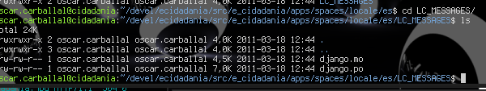

Translations
============

The translation for the e-cidadania platform can be done in two ways:

- `Transifex <http://transifex.net>`_
- gettext

Both ways of translating are simple thanks to the Django *middleware*, a couple
scripts and the transifex-client software.

Instead of making one global translation file, we decided to keep one
translation file for each application, this way even if the modules change
the translations will keep intact.

Translating with Transifex
--------------------------

To make translations with transifex you will need to have an account. After
that you can visit the e-cidadania project page
`here <https://www.transifex.net/projects/p/ecidadania/>`_.

After that you will need to sign up for a language team, and the administrator
will have to approve it.

Here is what you will see:

*image here*

You will have to select a language and after that, the component that you want
to translate. We split the components like the modules of e-cidadania, to
maintain the application integrity.

Once you finished you don't have to do anything, just keep updating the
translations until the string freeze period (usually 15 days before the
release)

.. note:: Section incomplete.

Translating with gettext
------------------------

Gettext is a well known tool by all the translators around the world. Its a
standard. Thanks to the django *middleware* our work will be minimum, we only
have to edit the .po files in the source files.

Instead of making one global translation, we decided to keep a translation file
for every module, that way the translations will keep even if the modules are
moved.

The location of the strings is usually a directory called **locale** inside the
module. Inside it, you can find directories with the country code (en, es, us,
gl, fr, etc.) and inside this one, the PO and MO files.

To translate, you must edit the PO file, which is a plain text file.

The MO file is the compiled version of the translation so the machine can read
it to use it.

Once you edited the .po, you have to send a pull request to the repository, and
that's all.

.. warning:: Stablish a workflow for translators and explain it here.

