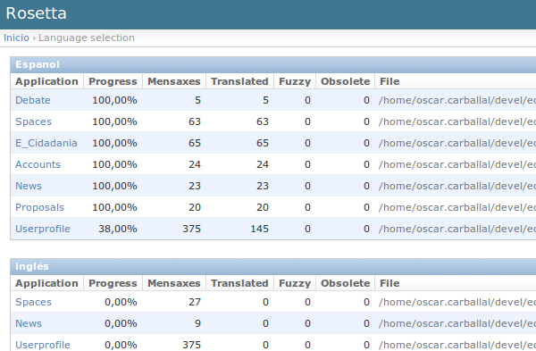

Translations
============

For the translation we use two tools:

- django-rosetta
- gettext

Both ways of translating are simple thaks to the Django *middleware*.

Translating with rosetta
------------------------

To make translations with rosetta, you will need to have an account on the system and
belong to the **'translators'** group. Once you have done that, the rest is simple.

Just access to the `translation URL`_ and the first you will see is a list with the
languages available to translate.

.. _translation URL: http://ecidadania.org/rosetta

Click on the component you want to translate and start translating (the translation is
done from english to other languages). If you find yourself stuck you can use the
option "Suggest" which will make a query to the Google Translate database and write
for you the translation.

.. warning:: Never trust the results of the "suggest" button. In most occasions
             will be incorrect.

Translating with gettext
------------------------

Gettext is a well known tool by all the translators around the world. Its a standard.
Thanks to the django *middleware* out work will be minimum, we only have to edit
the .po files in the source files.

.. image:: ../../images/gettext1.png
    :align: center

Instead of making one global translation, we decided to keep a translation file
for every module, that way the translations will keep even if the modules are moved.

The location of the strings is usually a directory called **locale** inside the
module. Inside it, you can find directories with the country code (en, es, us,
gl, fr, etc.) and inside this one, the PO and MO files.

To translate, you must edit the PO file, which is a plain text file.

The MO file is the compiled version of the translation so the machine can read it
to use it.

.. warning:: Stablish a workflow for translators and explain it here.

