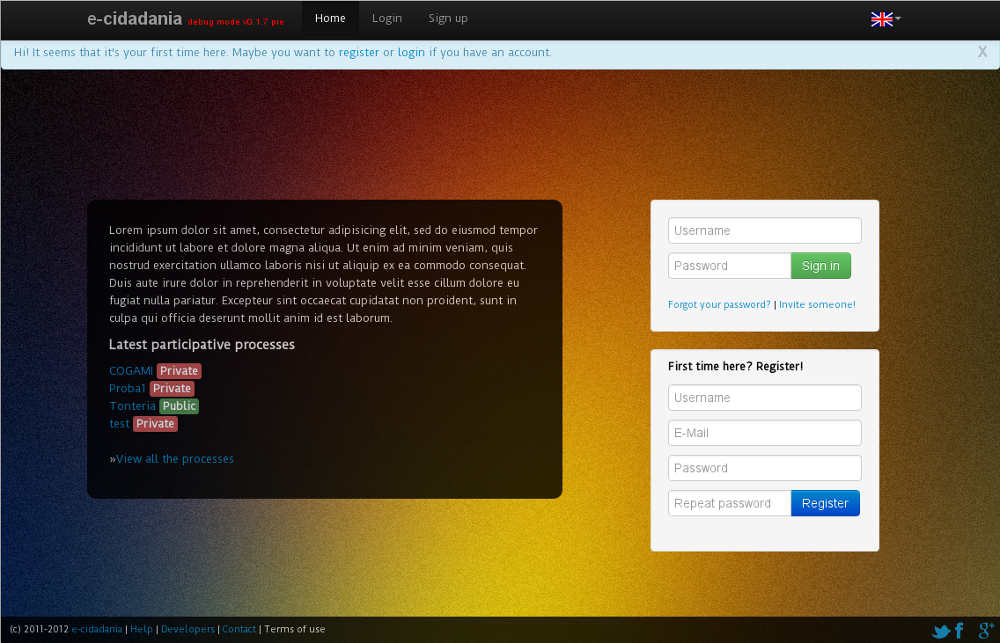

User manual
===========



What is e-cidadania
-------------------

e-cidadania is an e-democracy platform for citizen participation. Its main goal was to support participative budgets, but as we approached to it, we were able to do it flexible enough to be used in other citizen participation aspects as well. 

How to register
---------------

For registering in e-cidadania you just have to fill the form in the index page and click "Register". An email will be sent to you for activating the account. Once you do it you will be an e-cidadania user, able to participate in the public and private processes and even create your own ones.

After that you just have to put your username and password in the upper form in the index page and click "Log in".

Participating in a process
--------------------------

How to participate in a process
```````````````````````````````
There are two types of processes, *public* and *private*. For participating in a public process you just have to be registered in the platform, although you can view all the activities in the process without being registered, but you won't be able to participate in it.

For participating in private processes you will be presented a page with a button called "I want to participate". You just have to click on it and an email will be sent to the space administrators so they can approve or not your participation in the process.

Processes
`````````

What are they?
''''''''''''''

Processes are places where the citizen participation takes place. There can be debates, votings, news, events, documentation, etc.

Internally, they are designated as "spaces" where people can participate. Being a registered user in the platform allows you to create as many processes as you like and be their "space administrator".

How do they work
''''''''''''''''

A process can contain several modules or just one of them. A module is usually a functionality inside e-cidadania, for example, the voting module allows users to vote proposals or other kinds of stuff.

If you are a space administrator and you want to know how to use your administrator rights, please visit the :doc:`../docs/adminmanual`


Proposals
`````````

How to send a proposal
''''''''''''''''''''''

Sending proposals is very easy. You just have to access to your participative space
and click on "Proposals", after that you need to click on "Add new proposal" on
the right column.

A simple form will appear with several fields:

Title
    The proposal title. It must be a synthesis of the proposal.
    
Description
    An extensive description of the proposal. You can link various external elements
    like images, websites, videos, etc.

Latitude/Longitude
    Right now e-cidadania has a simple geolocation system. If you want your proposal
    to be geolocated to need to put the coordinates.

Tags
    Tags make proposal identification easier, for example::

        Title: The Apple Store sidewalk is broken
        Tags: broken, sidewalk, apple, store

Debates
```````

How to join a debate
''''''''''''''''''''

The debates system is new, so pay attention to not get lost, this is not like an
internet forum.

We have moved in-person debate models to this platform, and one of them is the
one we're going to show you. You'll see how fast you get used!

Voting
``````

News
````

Comments
''''''''

File repository
```````````````
To see or download any document you just have to click on the document and it
will start downloading. If the document you want doesn't appear in the list
you just have to make click on "See all documents" and a page will come up with
all the documents related to that participative process.

Frequently Asked Questions
--------------------------

If you have any frequently asked questions that doesn't appear here please tell us!
