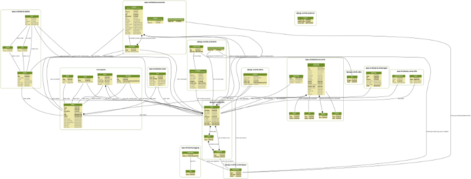

.. e-cidadania documentation master file, created by
   sphinx-quickstart on Mon Jan  3 11:34:17 2011.
   You can adapt this file completely to your liking, but it should at least
   contain the root `toctree` directive.

e-cidadania documentation
=========================

**e-cidadania** is an open-source e-democracy web tool intended for citizen participation.

e-cidadania was designed with complex participative processes in mind, lile a participative budget
where people can decide what to do with a part of the annual bugets of a region or city, where
making a simple meeting and disordered proposals doesn't meet the expectations.

This software is based on the `django <http://www.djangoproject.com>`_ framework
and some external libraries.

|Models|_

.. _Models: http://img19.imageshack.us/img19/4483/modelsbig.png

.. warning:: e-cidadania is in heavy development, because of that some parts
             of it may suffer changes, especially the data models and documentation
             until some releases.

Installation & Configuration
----------------------------

.. toctree::
    :maxdepth: 2

    docs/installation
    docs/configuration
    docs/deployment

Manuals
-------

.. toctree::
    :maxdepth: 3

    docs/usermanual
    docs/adminmanual

Appearance / Themes
-------------------

.. toctree::
    :maxdepth: 2

    theming/themes

Development
-----------

.. toctree::
    :maxdepth: 2

    dev/environment
    dev/styleguide
    dev/useraccounts
    dev/modules
    dev/documenting
    dev/i18n

Reference
---------

.. toctree::
    :maxdepth: 2

    reference/calendar
    reference/debate
    reference/spaces
    reference/proposals
    reference/news

Getting help
------------

- Try looking the `FAQ <http://ecidadania.org/faq>`_.
- e-cidadania mailing lists

  * ecidadania-users@freelists.org
  * ecidadania-dev@freelists.org
  * ecidadania-es@freelists.org

- Bug reporting in the e-cidadania `bug tracker <http://code.ecidadania.org>`_ or
  contact us through e-mail at info@ecidadania.org

:doc:`authors`