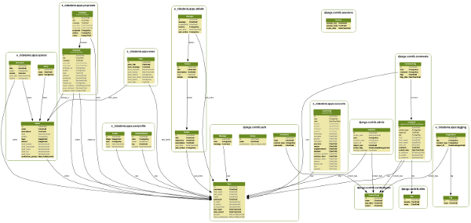

.. e-cidadania documentation master file, created by
   sphinx-quickstart on Mon Jan  3 11:34:17 2011.
   You can adapt this file completely to your liking, but it should at least
   contain the root `toctree` directive.

Bienvenido a la documentación de e-cidadania!
=============================================

**e-cidadania** es una plataforma web destinada a la participación ciudadana.
Para ello cuenta con una serie de herramientas clave como son el sistema de
propuestas, un revolucionario sistema de debate o un perfil avanzado de usuario
con geolocalización y mensajería.

Este programa está basado en el framework `django`_ y en varias librerías
externas.

.. warning:: e-cidadania está en una fase de desarrollo muy temprana y por ello
             algunas partes del programa así como los modelos de datos pueden
             sufrir grandes cambios hasta dentro de algunas versiones.

.. _django: http://www.djangoproject.com

Documentación
-------------
.. toctree::
    :maxdepth: 20

    docs/install
    docs/configure
    docs/adminmanual
    docs/usermanual

Desarrollo
----------
.. toctree::
    :maxdepth: 10

    reference/styleguide
    reference/accounting
    reference/proposals
    reference/debates
    reference/ldap

Plantillas
----------
.. toctree::
   :maxdepth: 10

   theming/reference
   theming/createyourown
   theming/othertemplates

Indices y tablas
----------------

* :ref:`genindex`
* :ref:`modindex`
* :ref:`search`

