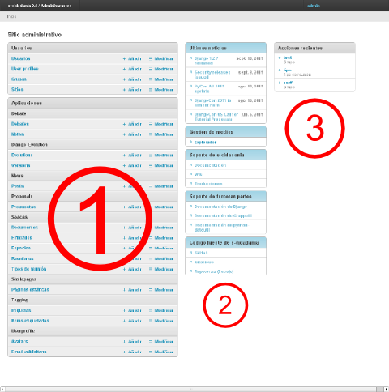

Manual de administración
========================

Este manual te enseñará cómo manejar e-cidadania para que no te pierdas nada de 
nada :).

Concretamente trata la parte del administrador del sitio sin meterse en detalles
técnicos innecesarios. Si en algún momento necesitas detalles técnicos es preferible
que leas el manual de desarrollo, en el cual está todo especificado.

Estructura del panel de administración
--------------------------------------

|Admin-es|_

.. _Admin-es: http://postimage.org/image/z7b8s72c/full/

La página principal del panel de administración se divide en tres grandes zonas:

 1. Esta zona contiene todas las aplicaciones de la plataforma. Desde aquí podrás
    añadir, editar o eliminar cualquier elemento de la base de datos.
    
    .. note:: Puede que aparezcan también otras aplicaciones de terceros, como
              django-evolution o similares, que son para la gestión de ciertos
              aspectos técnicos de la plataforma.
              
 2. Esta zona contiene lo que llamamos *widgets*. En ellos se puede mostrar casi
    cualquier tipo de información.
    
    Normalmente esos widgets vienen configurados por defecto. Si quieres cambiar
    su contenido basta con que edites el archivo **dashboard.py** que hay en
    la raíz de la aplicación, pero ojo, no te lo recomendamos si no sabes lo que
    estás haciendo. Si aún así quieres hacerlo, mira el `manual de django-grappelli <http://django-grappelli.readthedocs.org/en/latest/dashboard_api.html>`_.
    
 3. Esta es la zona de registro. Aquí se mostrará toda la actividad reciente que
    haya ocurrido en la plataforma.

Registro de usuarios
--------------------

Los usuarios tienen dos formas de registrarse:

* **A través del proceso participativo presencial** Se anotan para participar en el
  proceso, y se vuelcan sus datos en la base de datos de e-cidadania.
  
  En este caso tendrás que crear su usuario desde *"Usuarios"* y luego el perfil
  correspondiente desde *"User profiles"*

* **Registrándose ellos mismos** Esta es la forma más rápida pero también menos
  conveniente. Con este registro el usuario no tendrá ninguno de sus datos personales
  en la base de datos, ni pertenecerá a ningún proceso participativo salvo que se
  le permita. De la misma forma, sólo podrá visualizar los procesos participativos
  abiertos, pero no podrá participar a menos que se le incluya en el grupo.

.. note:: Este comportamiento es susceptible de cambiar en un futuro.

Por defecto e-cidadania tiene el registro de usuarios activado cuando se instala.
Para desactivarlo tendrás que comentar una línea de código en el siguiente archivo:

::

    apps/userprofile/urls/en.py:107
        # url(r'^register/$', register, name='signup'),

Permisos
--------

.. note:: En e-cidadania 0.2 se actualizará a permisos por fila, que permiten
          un nivel mucho más detallado de permisos.

Los permisos en e-cidadania están heredados directamente del sistema de autenticación
de django. De esa forma ya disponemos de permisos basados en grupo o individuales.

 * **Por grupo** Lo ideal es gestionar los usuarios a través de grupos. Se puede
   hacer accediendo al panel de administración desde el menú que hay arriba a la
   derecha, al lado del nombre de usuario.

   Una vez en el panel de administración basta con que hagamos clic en el botón que
   hay al lado de *"Grupos"* que pone *" + Añadir"* y ahí tendremos opción a configurar
   nuestros grupos.

   Como podrás observar, tenemos dos paneles de permisos y un campo para escribir el
   nombre. Basta con que pases los permisos que quieras para ese grupo al panel de
   la derecha (mediante las flechas que hay entre los dos paneles) y luego le pongas
   un nombre al grupo.

   Para guardar haz clic abajo a la derecha donde pone *"Guardar"*.

 * **Individuales** Puede que en algún momento quieras que alguien tenga una serie
   de permisos en concreto que no encajan en ninguno de los grupos que has creado.
   En ese caso es mejor darle los permisos al usuario en sí en vez de crear un
   grupo para él solo.

   Para ello debes editar al usuario haciendo clic en *"Usuarios"* y seleccionando el
   que quieras editar. Se te mostrarán una serie de datos del usuario como los grupos
   a los que pertenece, fecha de registro, etc. Lo que nos interesa son los paneles
   de permisos.

   Funcionan exactamente igual que los de grupo. Basta con que lo configures y guardes
   los cambios para aplicar los permisos al usuario.

Espacios
--------

Los espacios son zonas separadas en las cuales tienen lugar los procesos participativos.
Cada espacio puede configurarse a medida de las necesidades del proceso y no podrá
participar ningún usuario que no haya sido "admitido".

La creación de espacios corresponde al administrador de la plataforma, por medidas
de seguridad.

.. note:: Esta sección está sin terminar.

Módulos
-------

e-cidadania es una plataforma totalmente modular, incluso las características más
básicas como noticias, repositorio de documentos, espacios, sistema de propuestas, etc.
son módulos que pueden ser modificados o reemplazados sin afectar a la estructura
de la plataforma.

Moderación
----------

Las tareas de moderación dentro de la plataforma son muy sencillas. Cada módulo o
aplicación tiene tres tareas básicas: crear, editar y eliminar.

**Crear**
  Dependiendo del grado de moderación que tengas, podrás añadir contenido de
  distintos tipos. Los niveles de moderación más altos permiten crear prácticamente
  cualquier cosa y con un elevado grado de detalle.

**Editar**
  La tarea de edición es similar a la de creación, con la diferencia de que se te
  devolverá un formaluario con los datos del objeto que estés editando.
  
  El contenido generado por los usuarios debe ser preservado, sólo puede ser
  eliminado por los administradores del sitio.
  
**Eliminar**
  Normalmente en un foro, un moderador puede eliminar el contenido de un usuario.
  En e-cidadania ese no es el objetivo. Todo el contenido generado por los usuarios
  debe preservarse y sólo podrá ser eliminado por los administradores del sitio o
  bajo petición del propio usuario.

Errores frecuentes
------------------

Lista de errores más frecuentes a la hora de administrar.
