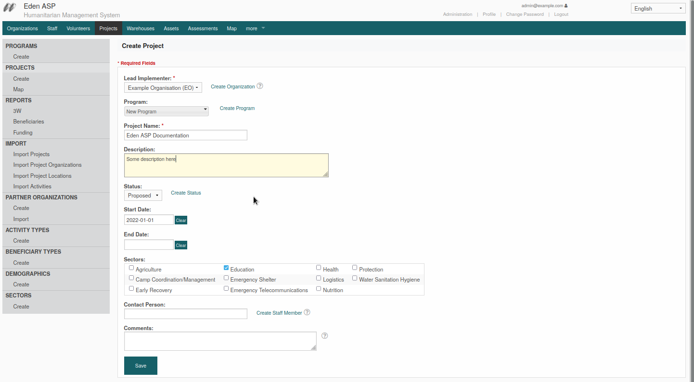
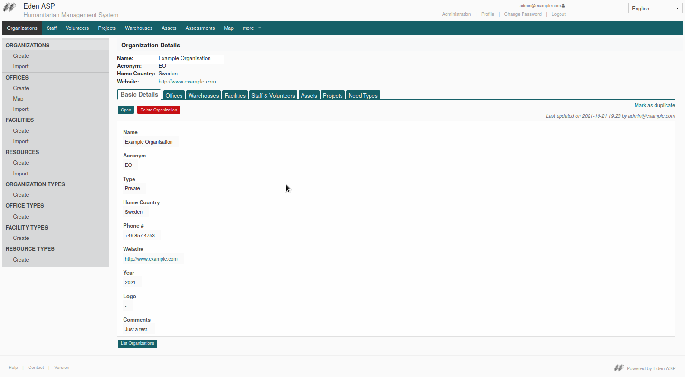
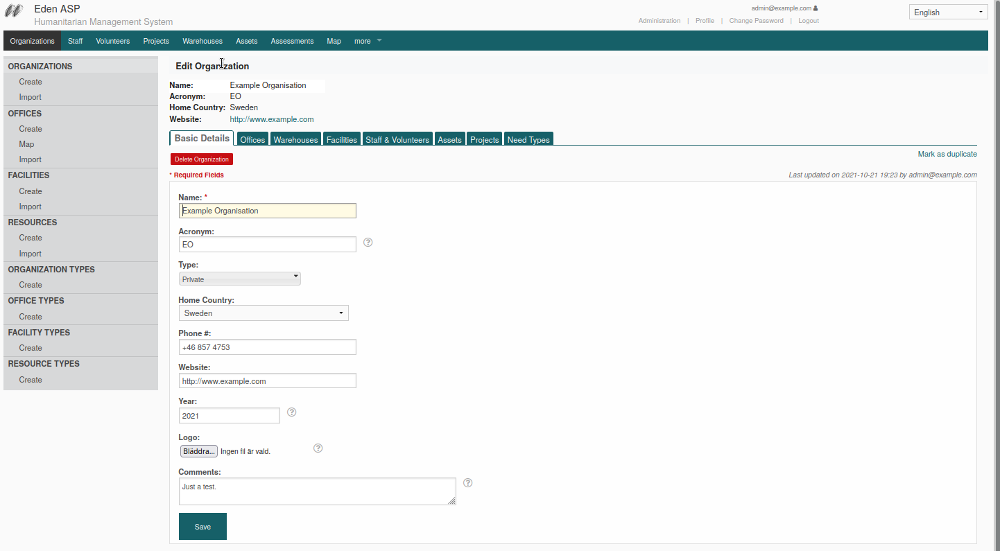

Form-based CRUD
===============

Simple, form-based Create, Read, Update and Delete functions.

Create
------

End-point: */create*

   Create-form

Read
----

End-point: *[id]/read*

   Read view with component tabs

Update
------

End-point: *[id]/update*

   Update-form on tab

Delete
------

End-point: [id]/delete
